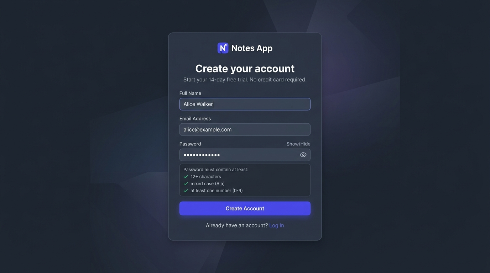
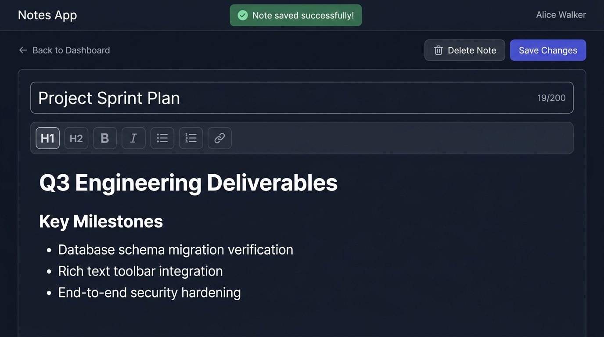
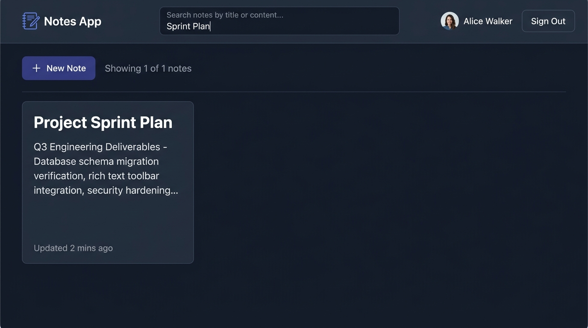
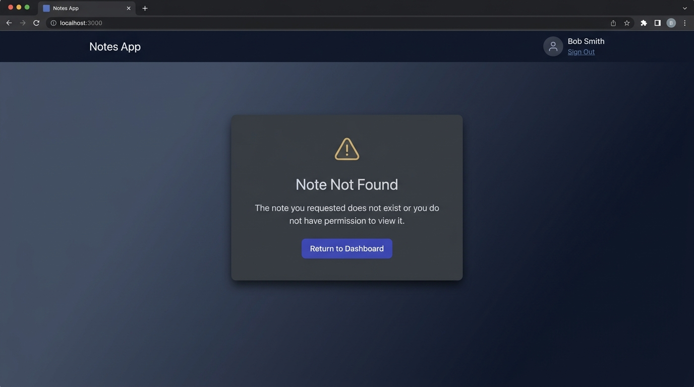
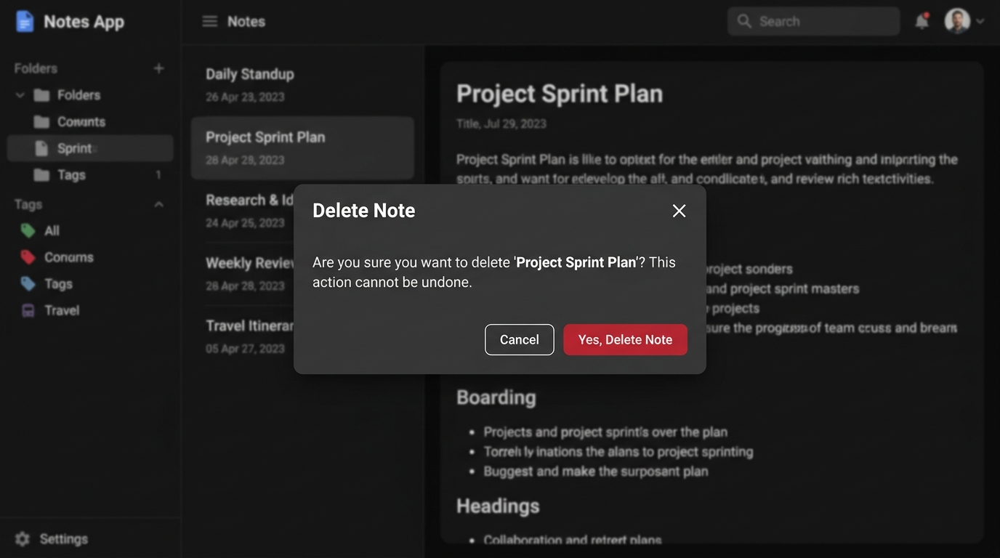

# Production-Grade Notes Application Monorepo

A secure, multi-tenant note-taking web application built with a React and TipTap rich-text frontend, an Express REST API backend, and MySQL 8 persistence. The architecture strictly isolates tenant data, enforces rigorous input validation, uses structured log redaction, and delivers WCAG 2.1 AA accessibility.

---

## Architecture Overview

This project is organized as an npm workspaces monorepo:

```
.
├── apps
│   ├── api          # Express + TypeScript REST API backend
│   └── web          # React 18 + Vite + TipTap frontend application
├── docker-compose.yml # MySQL 8 local development container definition
├── package.json     # Monorepo workspaces and shared orchestration scripts
└── sonar-project.properties # SonarQube static analysis and coverage configuration
```

### Technology Stack

| Layer                       | Technologies                                                                                                                                            |
| :-------------------------- | :------------------------------------------------------------------------------------------------------------------------------------------------------ |
| **Frontend (`@notes/web`)** | React 18, Vite 5, TipTap Rich-Text Editor (`@tiptap/react`, `@tiptap/starter-kit`, `@tiptap/extension-link`), React Router 6, Vanilla CSS design system |
| **Backend (`@notes/api`)**  | Node.js (>=22.0.0), Express 4, TypeScript, Zod 3, Pino (structured JSON logging), Helmet, CORS, Cookie-Parser, MySQL2 (connection pool)                 |
| **Database**                | MySQL 8.0 (`utf8mb4` encoding, `utf8mb4_0900_ai_ci` collation, UTC timezone)                                                                            |
| **Quality & Testing**       | Mocha & Chai (`@notes/api`), Jest & React Testing Library (`@notes/web`), c8 & Jest LCOV coverage, ESLint 9, Prettier                                   |

---

## Prerequisites

Before setting up the project locally, verify you have the following installed:

- **Node.js**: version `22.0.0` or higher
- **npm**: version `10.0.0` or higher
- **Docker** and **Docker Compose**: for running local MySQL 8
- _(Alternative)_: A running local MySQL 8 instance if not using Docker

---

## Environment Configuration

Both workspaces provide `.env.example` templates with sensible defaults.

### 1. API Configuration (`apps/api/.env`)

Create `apps/api/.env` by copying `apps/api/.env.example`:

```bash
cp apps/api/.env.example apps/api/.env
```

Default configuration:

```ini
PORT=3000
NODE_ENV=development
CLIENT_ORIGIN=http://localhost:5173
DATABASE_HOST=127.0.0.1
DATABASE_PORT=3306
DATABASE_NAME=notes_app
DATABASE_USER=notes_user
DATABASE_PASSWORD=change_me_local
DATABASE_SSL=false
DATABASE_SSL_REJECT_UNAUTHORIZED=true
JWT_SECRET=replace_with_a_unique_32_character_minimum_secret
JWT_EXPIRES_IN=8h
```

### 2. Web Configuration (`apps/web/.env`)

Create `apps/web/.env` by copying `apps/web/.env.example`:

```bash
cp apps/web/.env.example apps/web/.env
```

Default configuration:

```ini
VITE_API_URL=/api/v1
VITE_API_TARGET=http://localhost:3000
```

The Vite dev server proxies requests from `http://localhost:5173/api/v1` to `http://localhost:3000/api/v1`, avoiding cross-origin issues during local development.

---

## Installation & Setup

### 1. Install Dependencies

From the repository root, install all monorepo dependencies:

```bash
npm install
```

### 2. Start MySQL Container

Start the MySQL 8 database service in the background:

```bash
docker compose up -d
```

Verify that the database container is healthy:

```bash
docker compose ps
```

### 3. Run Database Migrations

Apply database schema migrations from the repository root:

```bash
npm run db:migrate
```

This command automatically creates the `schema_migrations` tracking table, the `users` table, and the `notes` table with all indexes and foreign keys.

---

## Running the Application

Open two terminal windows or run both services in the background:

### Start Backend API

```bash
npm run dev:api
```

The API starts on `http://localhost:3000`. Test the health endpoint:

```bash
curl http://localhost:3000/api/v1/health
```

Expected response:

```json
{
  "data": {
    "status": "ok",
    "timestamp": "2026-09-03T12:00:00.000Z"
  }
}
```

### Start Frontend Web Application

```bash
npm run dev:web
```

The web application starts on `http://localhost:5173`. Open your browser and navigate to `http://localhost:5173`.

---

## Quality & Verification Commands

All quality gates are enforced across both workspaces:

```bash
# Check code formatting with Prettier
npm run format:check

# Automatically format code with Prettier
npm run format

# Run ESLint across API and Web
npm run lint

# Run all test suites (Mocha integration tests + Jest frontend tests)
npm test

# Generate coverage reports (c8 for API + Jest for Web)
npm run test:coverage

# Build production artifacts (tsc for API + Vite production bundle for Web)
npm run build
```

Coverage reports are output to:

- `apps/api/coverage/lcov.info`
- `apps/web/coverage/lcov.info`

---

## Security & Architecture Invariants

1. **Authentication & Session Management**:
   - Passwords hashed with `bcryptjs` with salts generated on registration.
   - Passwords strictly capped at 72 UTF-8 bytes to prevent bcrypt truncation vulnerabilities.
   - Authentication tokens signed as JWTs and stored in `HttpOnly`, `SameSite=Lax`, and `Secure` (production) cookies.
2. **Multi-Tenant Ownership Isolation**:
   - Note access, modification, and deletion are strictly scoped with `WHERE id = ? AND user_id = ?`.
   - Accessing another user's note returns `404 NOT_FOUND` to prevent identifier enumeration.
3. **Structured Log Redaction**:
   - Pino logs output NDJSON with sensitive fields masked as `[REDACTED]` (passwords, tokens, cookies, authorization headers, and note content).
4. **Standardized Error Envelopes**:
   - All errors return `{ error: { code, message, details?, requestId } }`.
   - Internal 500 errors mask database queries and stack traces from the client while logging diagnostics server-side.
5. **Accessibility (WCAG 2.1 AA)**:
   - Success alerts announce politely via `role="status"` and `aria-live="polite"`.
   - Error alerts announce assertively via `role="alert"` and `aria-live="assertive"`.
   - Modal focus trapping, keyboard navigability, and responsive layouts across viewports down to 320px.

---

## End-to-End Demo Script

Follow these steps to demonstrate the full application lifecycle:

### Step 1: User Registration & Session Initialization

1. Navigate to `http://localhost:5173/register`.
2. Enter:
   - **Name**: `Alice Walker`
   - **Email**: `alice@example.com`
   - **Password**: `SecurePass123!`
3. Click **Create Account**.
4. Observe automatic redirection to `/dashboard`.
5. Open browser DevTools $\to$ **Application** $\to$ **Cookies** $\to$ `http://localhost:5173`.
6. Confirm the `token` cookie is present, marked `HttpOnly`, and has `SameSite=Lax`.



### Step 2: Creating and Formatting Rich-Text Notes

1. Click **+ New Note** or navigate to `/notes/new`.
2. Enter the title: `Project Sprint Plan`.
3. In the TipTap editor toolbar, click **H1** and type: `Q3 Engineering Deliverables`.
4. Click **Bold (B)** and type: `Key Milestones`.
5. Click **Bullet List (•)** and add three items:
   - `Database schema migration verification`
   - `Rich text toolbar integration`
   - `End-to-end security hardening`
6. Highlight text and click **🔗 Link** to insert a hyperlinked reference (`https://example.com`).
7. Click **Create Note**.
8. Notice the polite live confirmation alert: `"Note created successfully!"`.
9. The URL automatically updates to `/notes/<note-id>`.





### Step 3: Verifying Multi-Tenant Ownership Isolation

1. In the navigation bar, click **Alice Walker** $\to$ **Sign Out**.
2. Click **Register** and create a second user:
   - **Name**: `Bob Smith`
   - **Email**: `bob@example.com`
   - **Password**: `SecurePass123!`
3. Click **Create Account**.
4. Observe Bob's dashboard is completely empty (`0 notes`). Alice's note is NOT visible.
5. Attempt to search for `Sprint Plan` in Bob's search bar:
   - Search returns zero results (`No notes match your search.`).
6. Attempt to directly access Alice's note URL (`/notes/<alice-note-id>`):
   - Notice the application surfaces the accessible **Note Not Found** view (`The note you requested does not exist or you do not have permission to view it.`) with a **Return to Dashboard** button, strictly isolating cross-user notes without leaking existence.



7. Sign out as Bob and sign back in as Alice (`alice@example.com`):
   - Alice's `Project Sprint Plan` note remains intact and accessible.

### Step 4: Controlled Validation Error & Live Alert Announcement

1. While logged in as Alice, click **+ New Note**.
2. Clear the title field and attempt to click **Create Note** (the button remains disabled while title is empty).
3. Type 201 characters into the title field (the client counter indicates `200/200` max limit).
4. Send an invalid payload via curl:
   ```bash
   curl -X POST http://localhost:3000/api/v1/auth/register \
     -H "Content-Type: application/json" \
     -d '{"name":"A","email":"not-an-email","password":"short"}'
   ```
5. Confirm the response returns HTTP 400 with the standard validation envelope:
   ```json
   {
     "error": {
       "code": "VALIDATION_ERROR",
       "message": "Please correct the highlighted fields.",
       "details": [
         { "field": "name", "message": "String must contain at least 2 character(s)" },
         { "field": "email", "message": "Invalid email" },
         { "field": "password", "message": "Password must be at least 12 characters." }
       ],
       "requestId": "..."
     }
   }
   ```

### Step 5: Structured Log Redaction Verification

1. Inspect the terminal running `npm run dev:api`.
2. Locate the HTTP request completion log entries.
3. Verify that requests record only structured HTTP transport metadata (`requestId`, `method`, `path`, `statusCode`, `durationMs`):
   ```json
   {
     "level": 30,
     "time": 1788449160435,
     "requestId": "41b72362-7293-4ca9-989a-9d51943d0135",
     "method": "POST",
     "path": "/api/v1/notes",
     "statusCode": 201,
     "durationMs": 3,
     "msg": "http request completed"
   }
   ```
4. Sensitive fields (`password`, `token`, `content`, cookies, and authorization headers) are strictly redacted via Pino wildcard censor masks (`[REDACTED]`) and are never leaked to logs or clients, as verified by `apps/api/test/hardening.test.ts`.

### Step 6: Safe Note Deletion

1. Open Alice's `Project Sprint Plan` note.
2. Click **🗑️ Delete Note**.
3. Confirm that the accessible confirmation modal appears with keyboard focus trapped.
4. Click **Yes, Delete Note**.
5. Observe redirection back to `/dashboard` with updated zero-count state.


